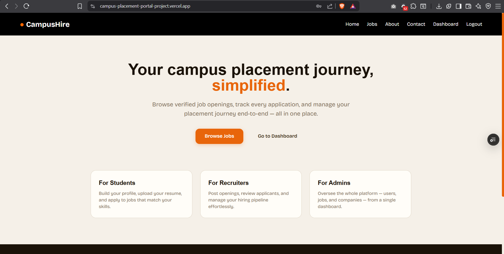
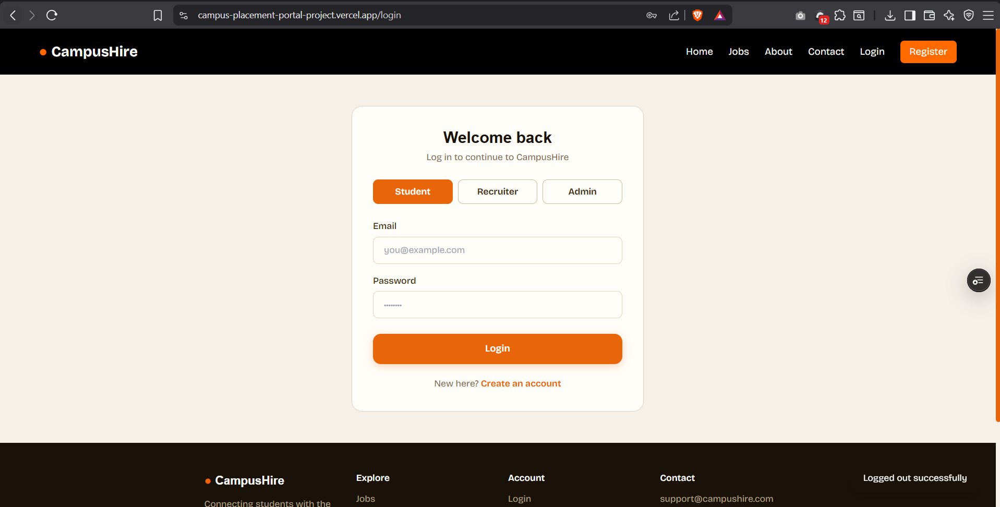
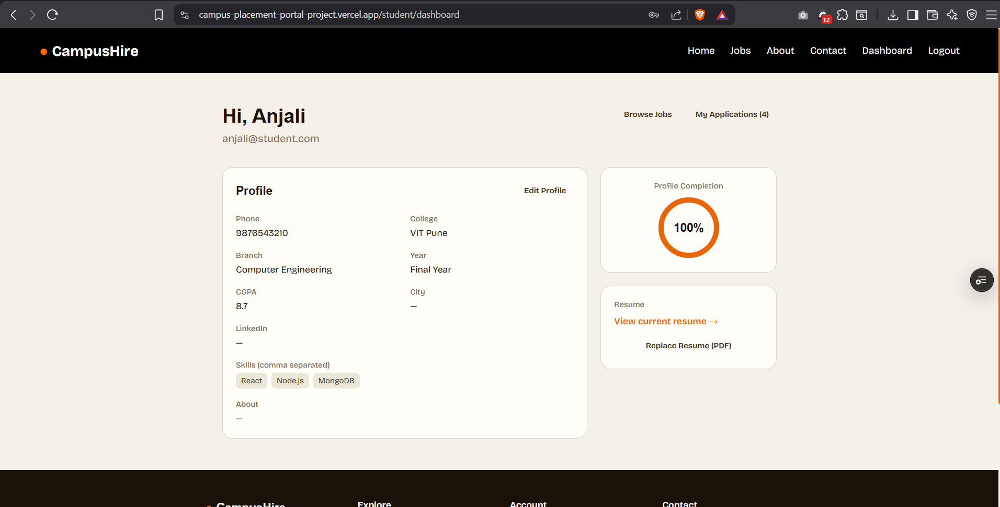
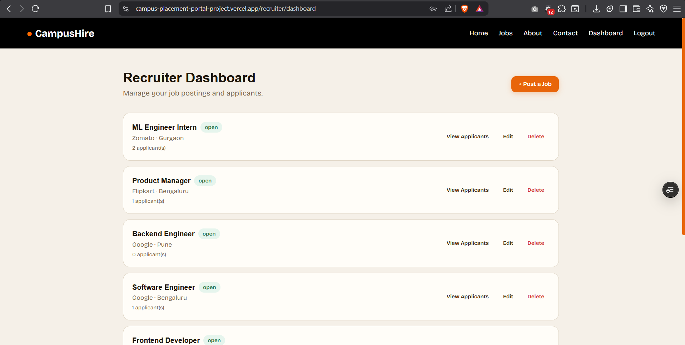
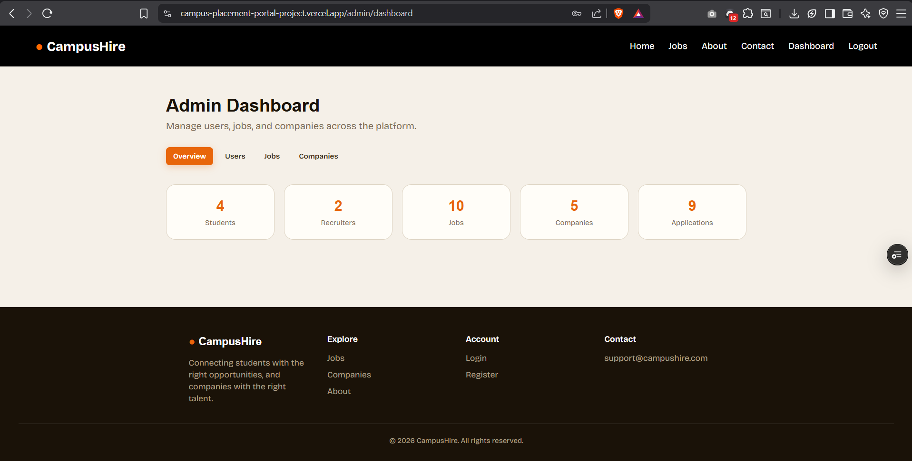
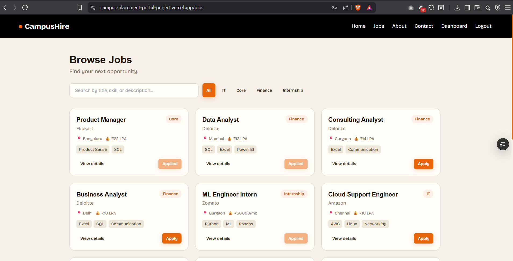

# 🎓 CampusHire - Campus Placement Portal

> A production-ready **MERN Stack Campus Placement Portal** that streamlines the entire campus recruitment process through secure authentication, role-based dashboards, resume management, job postings, and application tracking.

<p align="center">


</p>

---

## 🌐 Live Demo

### 🚀 Frontend

**https://campus-placement-portal-project.vercel.app**

### ⚙️ Backend API

**https://campus-placement-portal-api.onrender.com**

---

# 📌 Overview

CampusHire is a full-stack placement portal that connects **Students**, **Recruiters**, and **Administrators** on a single platform.

The application implements a complete recruitment workflow including secure authentication, profile management, resume uploads, job postings, application tracking, recruiter hiring pipeline, and admin management.

Unlike basic CRUD projects, CampusHire demonstrates production-oriented backend architecture with authentication, authorization, cloud storage integration, and role-based access control.

---

# ✨ Features

## 👨‍🎓 Student

- Secure Registration & Login
- JWT Authentication
- Profile Management
- Resume Upload (Cloudinary)
- Browse Jobs
- Search & Filter Jobs
- View Job Details
- Apply for Jobs
- Track Application Status
- Dashboard

---

## 👨‍💼 Recruiter

- Secure Login
- Recruiter Dashboard
- Create Jobs
- Edit Jobs
- Delete Jobs
- View Applicants
- Accept Applications
- Reject Applications
- Company Management

---

## 👨‍💻 Admin

- Admin Dashboard
- Manage Users
- Manage Recruiters
- Manage Students
- Manage Companies
- Manage Jobs
- Delete Records

---

# 🛠 Tech Stack

## Frontend

- React
- Vite
- React Router
- Axios
- Tailwind CSS

## Backend

- Node.js
- Express.js
- MongoDB Atlas
- Mongoose
- JWT Authentication
- bcrypt
- Multer
- Cloudinary

---

# 🏗 Architecture

```
                 React + Vite
                       │
                       │ Axios
                       ▼
             Express REST API
                       │
          ┌────────────┴────────────┐
          │                         │
          ▼                         ▼
    MongoDB Atlas              Cloudinary
(Database & User Data)      (Resume Storage)
```

---

# 📂 Folder Structure

```
CampusHire
│
├── client
│   ├── src
│   ├── public
│   └── package.json
│
├── server
│   ├── config
│   ├── controllers
│   ├── middleware
│   ├── models
│   ├── routes
│   ├── scripts
│   ├── utils
│   └── package.json
│
└── README.md
```

---

# 🔐 Authentication

- JWT Authentication
- Password Hashing using bcrypt
- Protected Routes
- Role-Based Authorization
- Student
- Recruiter
- Admin

---

# ☁️ Cloud Integration

- MongoDB Atlas
- Cloudinary Resume Upload
- Render Deployment
- Vercel Deployment

---

# 📸 Screenshots

## Home Page



---

## Login



---

## Student Dashboard



---

## Recruiter Dashboard



---

## Admin Dashboard



---

## Jobs



---

# 🚀 Getting Started

## Clone Repository

```bash
git clone https://github.com/atulchaudh15/campus-placement-portal-project.git
```

---

## Backend

```bash
cd server
npm install
npm run dev
```

---

## Frontend

```bash
cd client
npm install
npm run dev
```

---

# ⚙️ Environment Variables

## Backend (.env)

```env
NODE_ENV=development

PORT=5000

JWT_SECRET=your_secret

CLIENT_URL=http://localhost:5173

MONGODB_USER=

MONGODB_PASSWORD=

MONGODB_CLUSTER=

MONGODB_DB=

CLOUDINARY_CLOUD_NAME=

CLOUDINARY_API_KEY=

CLOUDINARY_API_SECRET=
```

---

## Frontend (.env)

```env
VITE_API_URL=http://localhost:5000/api
```

---

# 👨‍💻 Demo Credentials

## Student

```
Email:
anjali@student.com

Password:
Password@123
```

---

## Recruiter

```
Email:
recruiter1@campushire.com

Password:
Password@123
```

---

## Admin

```
Email:
admin@campushire.com

Password:
Password@123
```

---

# 🚀 Deployment

Frontend → Vercel

Backend → Render

Database → MongoDB Atlas

Storage → Cloudinary

---

# 📈 Future Improvements

- Email Notifications
- Interview Scheduling
- Company Analytics Dashboard
- Pagination
- Advanced Search
- AI Resume Screening
- Real-time Notifications

---

# 🤝 Contributing

Contributions are welcome.

Feel free to fork this repository and submit pull requests.

---

# ⭐ Support

If you found this project helpful, consider giving it a ⭐ on GitHub.

---

# 👤 Author

**Atul Chaudhary**

GitHub:
https://github.com/atulchaudh15